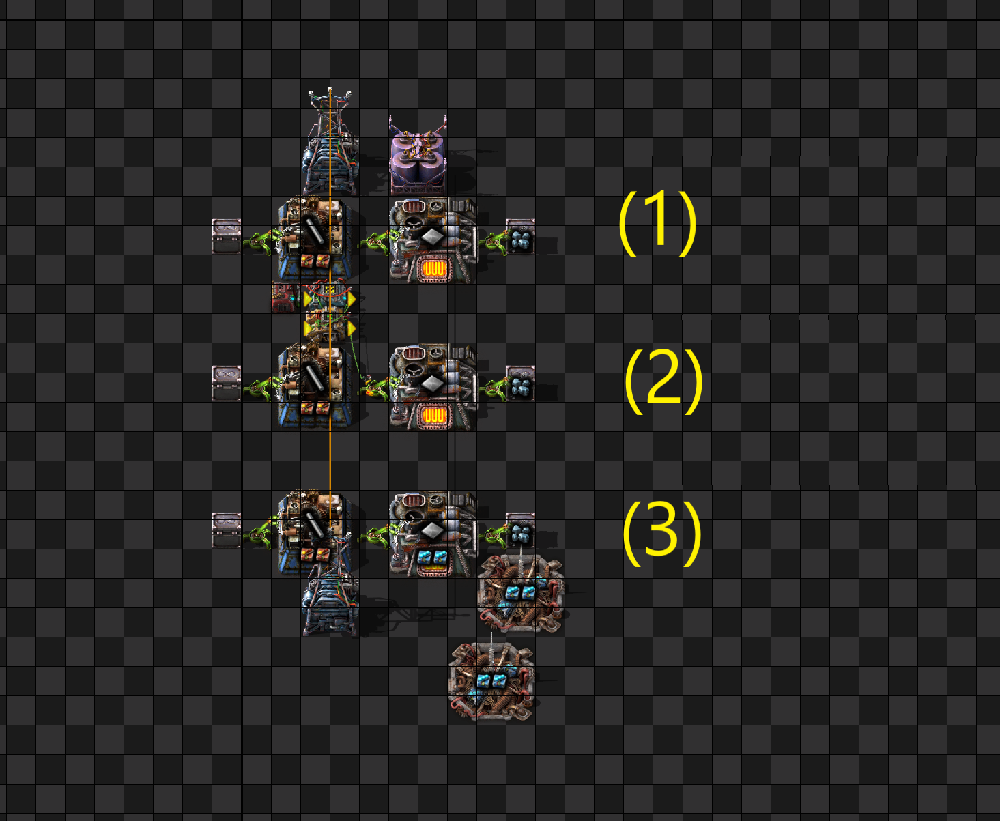

# Сalculation of "clock" timings for assembly machines
## A "clock" - what is it?



1. The assembly machine works faster than the melting furnace

This leads to the fact that the inserter takes 1 plate instead of 12 ->  need to do extra swings -> bad for UPS

2. **clock** UPS optimization technique

We specifically slow down the work of the inserter, now the inserter always takes 12 items

cons - logic circuits are needed

3.  **back pressure** UPS optimization technique

we accelerate the work of the melting furnace, as a result, we have overproduction - there are always 100 plates in the furnace

now the inserter always takes 12 items

cons  - you need more furnaces, beacons, modules, etc.

but there will be a benefit for UPS

BP:
```
0eNrNWF2vojAQ/S9N9g02tohezWZ/xb5tDOFj1OZCIW0x6xr/+04Bkat1hV43WZ9aSs/MnDmdDp5IktdQSS40WZ8IT0uhyPrniSi+E3FunuljBWRNuIaCeETEhZlBDqmWPPW3tRRxCuTsES4y+EXW9Ow93R4rBUWSc7HzizjdcwE+G0Cw88YjIDTXHFp3mskxEnWRgEQbPZKqE6VjzUuB6FWpeDNEuwgTsMAjR7IO6RKxBfDdPilraRDZcmPcvIFl9/GBALk7+sgPyK0J1GJlMbCScYk7m1VES+rtFmSk+G8EpbP+Z7Ed9La52HKBS366B6UtBunqa9iZxFFDW7sjUqA1kqrMmxKK8gBRjWs5Og9ZZHKAS1rWcLZ4ML+SquP0HWNWIHGnLeTZjQfDsC3Q4d8zbzHAbgwgPG+FJEvhK83Td9zWRXQilSyzGh04GN4KHOdgPLG4snisYVtqP7hhgVtOIG0+jbS3CdBv06BX48XGPie2bZwr8Ej7uD3LF8smkaU0tKdlbepPOPMI5q6RifZziBuH+rKysfFPZ30opnbpWGg/LYuEi1iXVqroJR4zujuxCKJlmUcJ7OMDRwTcNnT+rrAduNQ1Prkmq3nD/2HqWRcY/RBFY0S0NhvyaMtgNqx0HGcU96VcpjXX7dxQYOPgWg5jyfW+ADweT1gIJnJwBY5wOeO981sulY6m0aLAYESXhJkIQrRbViDbUr4mX3BnWeuqnoZ9dmd3eE6a9VmTKzY+OR7ZSQBx92YwMo3MvUqa2vLKKkmv11GGmBnIkXpiI/XUob5ATAMVmUlRxbJxck2+OWgoybHUtrDVMWrOb7SVZRFxgThdPXukMnv673TWy8r+/vKRPuZuV1ejDRte6NJydEp7TctBFy49R+fCkzuOOl3NFmy7gC8p7QXsoN+B2C4ant1o+DuZJrbgXmxW4p2ai5HEO3UXTrr6190FmzkdkVd25Yw6HZFRbSD7zI3z4r6cBY7VrSP7YlFVAFlnyg8eGZs71YZxpIZOR2sc9sLpaP2PjTtbTvuGD9jtNzy1fsJfC1sCcWqH7JkJqIt4ViNM9IkN5k9NbNplg9f/GeORA9LeCuGNzpcrtgxpSIPF7Hz+A1LR6fQ=
```


## Плавильные печи
