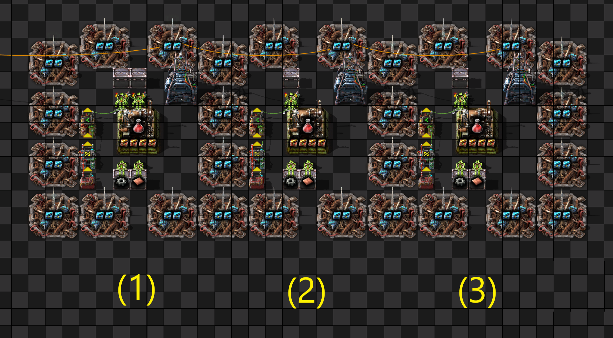

# Сalculation of "clock" timings for assembly machines

## A "clock" - what is it?


### The assembly machine works faster than the melting furnace (1)

This leads to the fact that the inserter takes 1 plate instead of 12 ->  need to do extra swings -> bad for UPS.

### "clock" UPS optimization technique (2)

We specifically slow down the work of the inserter, now the inserter always takes 12 items.

cons - logic circuits are needed.

### "back pressure" UPS optimization technique (3)

We accelerate the work of the melting furnace, as a result, we have overproduction - there are always 100 plates in the furnace.

Now the inserter always takes 12 items.

cons  - you need more furnaces, beacons, modules, etc. But there will be a benefit for UPS.

BP:
```
0eNrNWF2vojAQ/S9N9g02tohezWZ/xb5tDOFj1OZCIW0x6xr/+04Bkat1hV43WZ9aSs/MnDmdDp5IktdQSS40WZ8IT0uhyPrniSi+E3FunuljBWRNuIaCeETEhZlBDqmWPPW3tRRxCuTsES4y+EXW9Ow93R4rBUWSc7HzizjdcwE+G0Cw88YjIDTXHFp3mskxEnWRgEQbPZKqE6VjzUuB6FWpeDNEuwgTsMAjR7IO6RKxBfDdPilraRDZcmPcvIFl9/GBALk7+sgPyK0J1GJlMbCScYk7m1VES+rtFmSk+G8EpbP+Z7Ed9La52HKBS366B6UtBunqa9iZxFFDW7sjUqA1kqrMmxKK8gBRjWs5Og9ZZHKAS1rWcLZ4ML+SquP0HWNWIHGnLeTZjQfDsC3Q4d8zbzHAbgwgPG+FJEvhK83Td9zWRXQilSyzGh04GN4KHOdgPLG4snisYVtqP7hhgVtOIG0+jbS3CdBv06BX48XGPie2bZwr8Ej7uD3LF8smkaU0tKdlbepPOPMI5q6RifZziBuH+rKysfFPZ30opnbpWGg/LYuEi1iXVqroJR4zujuxCKJlmUcJ7OMDRwTcNnT+rrAduNQ1Prkmq3nD/2HqWRcY/RBFY0S0NhvyaMtgNqx0HGcU96VcpjXX7dxQYOPgWg5jyfW+ADweT1gIJnJwBY5wOeO981sulY6m0aLAYESXhJkIQrRbViDbUr4mX3BnWeuqnoZ9dmd3eE6a9VmTKzY+OR7ZSQBx92YwMo3MvUqa2vLKKkmv11GGmBnIkXpiI/XUob5ATAMVmUlRxbJxck2+OWgoybHUtrDVMWrOb7SVZRFxgThdPXukMnv673TWy8r+/vKRPuZuV1ejDRte6NJydEp7TctBFy49R+fCkzuOOl3NFmy7gC8p7QXsoN+B2C4ant1o+DuZJrbgXmxW4p2ai5HEO3UXTrr6190FmzkdkVd25Yw6HZFRbSD7zI3z4r6cBY7VrSP7YlFVAFlnyg8eGZs71YZxpIZOR2sc9sLpaP2PjTtbTvuGD9jtNzy1fsJfC1sCcWqH7JkJqIt4ViNM9IkN5k9NbNplg9f/GeORA9LeCuGNzpcrtgxpSIPF7Hz+A1LR6fQ=
```

## Calculation of timings for melting furnaces

[Great guide](https://www.reddit.com/r/technicalfactorio/comments/ju2ngg/inserter_clocking_tutorial/)

## Сalculation of "clock" timings for assembly machines

We calculate the "maximum crafts" by the [formula](https://forums.factorio.com/viewtopic.php?p=309796#p309796)

```
maximum_crafts = Math::clamp(uint32_t(std::ceil(1.166 / (recipeCraftingTime / craftingMachineCraftingSpeed))) + 1,
                     2,
                     100);
```

### If maximum_crafts >= 12

We are lucky and use "back pressure" or a [Great guide](https://www.reddit.com/r/technicalfactorio/comments/ju2ngg/inserter_clocking_tutorial/)

### If maximum_crafts < 12

Consider the calculation of timings for example:

[b12 red](https://kirkmcdonald.github.io/calc.html#data=1-1-19&rate=s&min=3&belt=express-transport-belt&dm=p3&vis=box&vf=r&items=automation-science-pack:f:1&modules=automation-science-pack:;s3:24)

2 + 6/25 red/sec

maximum_crafts = 3 < 12 ( [link](https://onlinegdb.com/uG0Mjc1v1) )

If we load **X** gears, we will produce:
* 12 gears -> 12*1.4 = 16.8 reds
* 11 gears -> 11*1.4 = 15.4 reds
* 10 gears -> 10*1.4 = 14 reds
* 9 gears -> 9*1.4 = 12.6 reds
* 8 gears -> 8*1.4 = 11.2 reds

We have to take all the "reds" at once. Since 16.8 > 12, various options are possible:



#### Two inserters (1)
[timing](https://www.wolframalpha.com/input?i=%282+%2B+6%2F25%29%2F16.8%2F60)

#### One inserter, but works 2 times more often (2)
[timing](https://www.wolframalpha.com/input?i=2*%282+%2B+6%2F25%29%2F16.8%2F60)

#### One inserter, but we load 8 gears into the assembly machine (3)
[timing](https://www.wolframalpha.com/input?i=%282+%2B+6%2F25%29%2F11.2%2F60)

BP:
```
0eNrtmttu2zgQht+FwN5ZhUgdLBmLvdnHWASCLI9tojqBorL1Fn73HcqOZSdyzKGbNCnai6CyxPnJ4cfh8PCdLcseWiVrzRbfmSyaumOLf76zTm7qvDS/6V0LbMGkhorNWJ1X5mkJOX7K9jMm6xV8Ywu+f5gxqLXUEg4WhoddVvfVEhR+8LzsjLVNh5/jf1EFTaRJ+iWasR1+m/rhl8gYR9HOvO5agJVXNau+BC9gC7Hfz15IiNsSaXCfRHCSgBIKrWThQQ1qs/PQg6DWeQFTqvGTZoCKK6mw6PAaa7zs12tQWSf/Q6vcP/2bEA8t2nenC6ObEljFO30Y22jc2Y65hQa/sx2JBdHxKBE5SKQWPX6nBPdtuuNeEW7TH/eKCFqHJC4aYwCQ9VrW+M4rttDpqZ7ho1Z80DoWyTrQWtabQVdB1TxC1uO7EkMIrLJjlbTqYbIOYxzodF58xdDTgcKiN+owH+pwFn3QDnpJq6bMlrDNH2WjTLlCqqKXOsN3q5OxtVSdzl7MCo9S6R5/GWs0fGF8Unw104OZUHRuZhffPFRtrnJtdNhfbH94Xx/qMziDmz8bBVCfzyFyhQ2I9g/7SXdEBHf4v4w7wjNXmB8Ehrynqg7P19wVEwj234jgMTx3/RIdMohO6IenzkLtGuRmu2x6ZfILwR+mDCe0gOkUAlJrB5rp/G08KHxr6C8r8bmpF6kd5IJbAYauuU4YQiqiKciEIM6YLpSJgNDB/Jfp4IBbdnBIGIT8rQZhZEkZp8YxERPzJSfExii8gkKuQHnYdUtZD103kTslo166n6bqaGikqnPA6u9LpPgzpP7EAk2v296N1HaHtetrna1VU2WyRjtssc7LDmikhi9JnTFBz1/EOGflXQfVskQgvSovtrI2nfd6UpcOHY+DXQ7tz3vdVAOHXldIqAvwWowe7IyNViEW2MJHM2ZGRMLJuqU0RNLfiJwjktAQEf4VRAKfiAjOP+/GSMBJjGDVfkNy1umhIEISXINEkCHh7wdJQFqbm4rR9+bGnCBXUm8r0LKwntI4v4LiaOsH0NiBsZGNUIYRju2mBXVIHhbsDwcq0fQ15jCNuT1zXa4kw2RE0KL4sPM7jer8xZfT5EZOGxpHSM5T3SnjsdP2gKXxOWm96YZ1QsY6/elYC5MbvzPWyetYR8HrWCfWWKeWWKdua3Q79ELSDgB11ISctsZ1IjsUVLIvkoefhHbgv3vEfpkjXKId+6+i/bz4dbSfL7+voR2SdidehQ999whKYbaXDaaOJ2HJlGrotidyp2pEW4u7DYWYlh+5nFeFc9IRrJvGOFk9jRj7DEwMglMj+rAjc+Vk+kb63x9z//Gg2j1VujoeUqdjoWOL6btRswuPnBzeYlTy2jLX5hD6qeUmXGGvDVFWeyXkQ63OvDF1DOw7HRL82PZIhYuPDeTK+3cLUE43Cb7lhS53t1vESZcDnOCPBC0bdNIIiAMs/dgDLLEbYBHt7oObayO3g52PTH1MadJnCExz2gUVNxASYvLrJJLSrsE4icQ+LVpc5tcfL1xMZLKT4SLmlOOhT8B9LNzOuz5wbIoD2h0ttwEQEpP32yIPh9fG4unq5IzhaqI7XOlLeDhPxTxOhZ8E+P3/ptG64Q==
```

**Important:** I do not know which option is better for UPS. You will have to make benchmarks yourself.